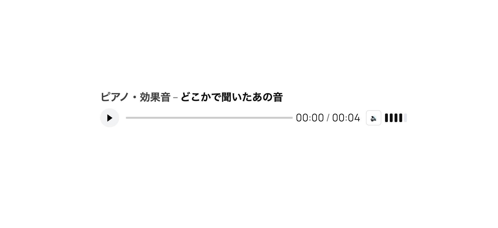

# WP Audio Card

WordPress 用の軽量カスタム音声プレイヤーです。  
タイトル・ジャンル表示、シークバー、経過時間 / 総時間、5段階ボリュームコントロールを備えています。



## 主な機能
- **ジャンル** と **タイトル** 表示
- **再生 / 一時停止** ボタン
- **シークバー**（ドラッグ可能）
- **経過時間 / 総時間** 表示
- **5段階ボリューム** + ミュートボタン
- 複数設置対応
- ARIA 対応（スクリーンリーダーでも利用可）
- 軽量・CSS/JS完全カスタム可能

## インストール方法
1. このリポジトリを ZIP でダウンロード、または  
   `wp-content/plugins/wp-audio-card/` にクローンします。
2. WordPress 管理画面から **WP Audio Card** を有効化します。

## 使い方

### テーマの PHP テンプレート内で呼び出し
```php
<?php echo do_shortcode('[audio_card src="https://example.com/sample.mp3" title="番組CMナレーション" genre="ハイテンション・バラエティ"]'); ?>
```

## ショートコード属性

| 属性名    | 必須 | 説明                         | デフォルト | 
| --------- | ---- | ---------------------------- | ---------- | 
| `src`     | 必須 | MP3ファイルのURL             | -          | 
| `title`   | 任意 | トラックタイトル             | Untitled   | 
| `genre`   | 任意 | ジャンル名                   | 空         | 
| `preload` | 任意 | `none` / `metadata` / `auto` | metadata   | 


## よくある質問（FAQ）

Q. 複数の音声プレイヤーを同じページに設置できますか？

はい。ショートコードを複数回呼び出すことで、複数設置可能です。

Q. 音声の総時間がSafariで表示されない場合があります

Safariは総時間の取得が遅れる場合がありますが、本プラグインではイベント監視・ポーリング・ダミーシークによる対策を実装しています。

## スクリーンショット

プレイヤー表示例（ジャンル・タイトル・シークバー・ボリュームコントロール）

## 更新履歴（Changelog）

### 1.0.0

初回リリース

## アップグレード情報（Upgrade Notice）

1.0.0
初回リリース