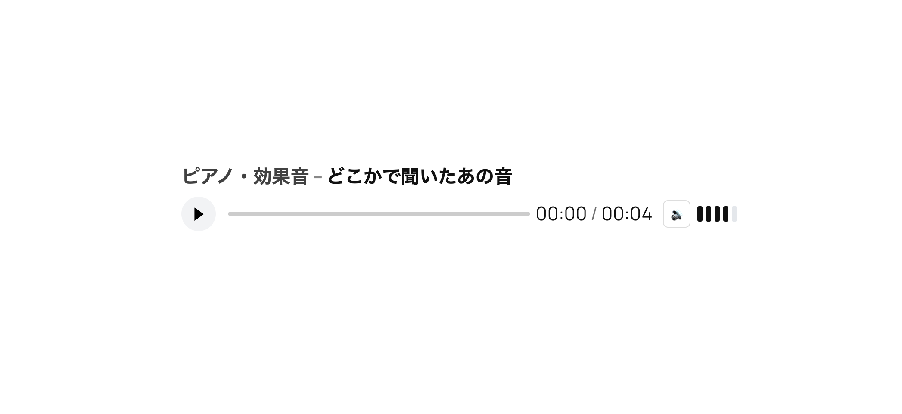

# WP Audio Card

WordPress 用の軽量カスタム音声プレイヤーです。  
タイトル・ジャンル表示、シークバー、経過時間 / 総時間、5段階ボリュームコントロールを備えています。



## 主な機能
- **ジャンル** と **タイトル** 表示
- **再生 / 一時停止** ボタン
- **シークバー**（ドラッグ可能）
- **経過時間 / 総時間** 表示
- **5段階ボリューム** + ミュートボタン
- 複数設置対応
- ARIA 対応（スクリーンリーダーでも利用可）
- 軽量・CSS/JS完全カスタム可能

## インストール方法
1. このリポジトリを ZIP でダウンロード、または  
   `wp-content/plugins/wp-audio-card/` にクローンします。
2. WordPress 管理画面から **WP Audio Card** を有効化します。

## 使い方

### テーマの PHP テンプレート内で呼び出し
```php
<?php echo do_shortcode('[audio_card src="https://example.com/sample.mp3" title="番組CMナレーション" genre="ハイテンション・バラエティ"]'); ?>
```

- プロキシ配信をオフにする場合（直接URLを利用）
```php
<?php echo do_shortcode('[audio_card src="https://example.com/sample.mp3" title="Direct" secure="0"]'); ?>
```

- 明示的にオンにする場合（デフォルトはオン）
```php
<?php echo do_shortcode('[audio_card src="https://example.com/sample.mp3" title="Secure" secure="1"]'); ?>
```

## ショートコード属性

| 属性名    | 必須 | 説明                                                                 | デフォルト |
| --------- | ---- | -------------------------------------------------------------------- | ---------- |
| `src`     | 必須 | MP3ファイルのURL                                                     | -          |
| `title`   | 任意 | トラックタイトル                                                     | Untitled   |
| `genre`   | 任意 | ジャンル名                                                           | 空         |
| `preload` | 任意 | `none` / `metadata` / `auto`                                         | metadata   |
| `secure`  | 任意 | トークン付きプロキシ配信を使うか（`1/0`, `true/false`, `yes/no` 等） | 1          |

注意:
- `secure=1` の場合、同一サイトのメディアライブラリ（uploads）配下の mp3 のみプロキシ対象です。対象外URLは自動で直接URLにフォールバックします。
- トークンの有効期限は 10 分（変更可）。完全なダウンロード防止は不可能ですが、直リンク共有の抑止に有効です。

## よくある質問（FAQ）

Q. 複数の音声プレイヤーを同じページに設置できますか？

はい。ショートコードを複数回呼び出すことで、複数設置可能です。

Q. 音声の総時間がSafariで表示されない場合があります

Safariは総時間の取得が遅れる場合がありますが、本プラグインではイベント監視・ポーリング・ダミーシークによる対策を実装しています。

## スクリーンショット

プレイヤー表示例（ジャンル・タイトル・シークバー・ボリュームコントロール）

## 更新履歴（Changelog）

### 1.1.2
- iOS では 5 段階ボリューム UI を非表示にするスタイルを追加（ハードウェア音量に依存）
- キャッシュ更新のためバージョンを更新

### 1.1.0
- 短期トークン付きプロキシ配信（REST）を追加
- shortcode に secure 属性を追加（デフォルト on、失敗時は元URLにフォールバック）
- uploads 判定をパス基準に修正（ホスト/ポート差異を許容）
- Range リクエスト対応、IP紐づけ、トークン有効期限設定

### 1.0.0
初回リリース

## アップグレード情報（Upgrade Notice）

1.1.2
iOS 向けの表示調整。ブラウザキャッシュをクリアしてください。

1.1.0
プロキシ配信を導入（互換性あり）。キャッシュをクリアしてください。